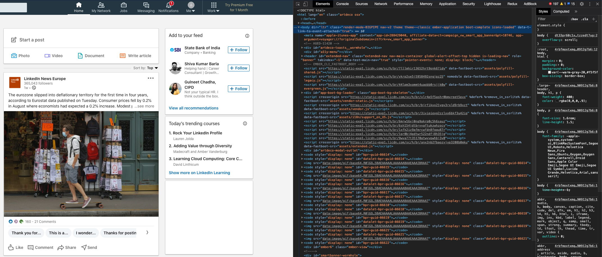
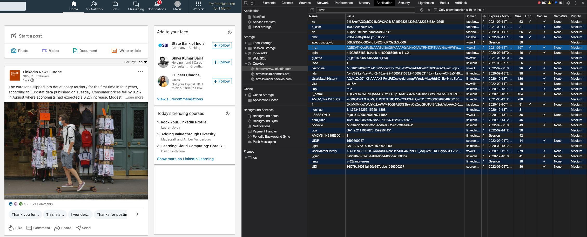

# linkedin-jobs-scraper
> Scrape public available jobs on Linkedin using headless browser. 
> For each job, the following fields are extracted: `jobId`, 
> `title`, 
> `company`,
> `[companyLink]`,
> `[companyImgLink]`,
> `place`, 
> `date`, 
> `link`, 
> `[applyLink]`,
> `description`, 
> `descriptionHTML`,
> `insights`. <br><br>
> It's also available an equivalent [package in python](https://github.com/spinlud/py-linkedin-jobs-scraper).

<span style="color:red">⚠ **DISCLAIMER** This package is meant for personal or educational use only. All the data extracted by
using this package is publicly available on the LinkedIn website and it remains owned by LinkedIn company.
I am not responsible in any way for the inappropriate use of data extracted through this library.
</span>

## Table of Contents

<!-- toc -->

* [Installation](#installation)
* [Usage](#usage)
* [LinkedinScraper](#linkedinscraper)
* [Anonymous vs authenticated session](#anonymous-vs-authenticated-session)
* [Rate limiting](#rate-limiting)
* [Filters](#filters)
* [Company filter](#company-filter)
* [Logger](#logger)
* [Sponsors](#sponsors)
* [License](#license)

<!-- toc stop -->


## Installation
Install package:
```shell
npm install --save linkedin-jobs-scraper
```


## Usage 
```ts
import { 
    LinkedinScraper,
    relevanceFilter,
    timeFilter,
    typeFilter,
    experienceLevelFilter,
    onSiteOrRemoteFilter,
    baseSalaryFilter,
    events,
} from 'linkedin-jobs-scraper';

(async () => {
    // Each scraper instance is associated with one browser.
    // Concurrent queries will run on different pages within the same browser instance.
    const scraper = new LinkedinScraper({
        headless: 'new',
        slowMo: 200,
        args: [
            "--lang=en-GB",
        ],
    });

    // Add listeners for scraper events
    
    // Emitted once for each processed job
    scraper.on(events.scraper.data, (data) => {
        console.log(
            data.description.length,
            data.descriptionHTML.length,
            `Query='${data.query}'`,
            `Location='${data.location}'`,
            `Id='${data.jobId}'`,
            `Title='${data.title}'`,
            `Company='${data.company ? data.company : "N/A"}'`,
            `CompanyLink='${data.companyLink ? data.companyLink : "N/A"}'`,
            `CompanyImgLink='${data.companyImgLink ? data.companyImgLink : "N/A"}'`,
            `Place='${data.place}'`,
            `Date='${data.date}'`,
            `Link='${data.link}'`,
            `applyLink='${data.applyLink ? data.applyLink : "N/A"}'`,
            `insights='${data.insights}'`,
        );
    });
    
    // Emitted once for each scraped page
    scraper.on(events.scraper.metrics, (metrics) => {
        console.log(`Processed=${metrics.processed}`, `Failed=${metrics.failed}`, `Missed=${metrics.missed}`);        
    });

    scraper.on(events.scraper.error, (err) => {
        console.error(err);
    });

    scraper.on(events.scraper.end, () => {
        console.log('All done!');
    });

    // Custom function executed on browser side to extract job description [optional]
    const descriptionFn = () => {
        const description = document.querySelector<HTMLElement>(".jobs-description");
        return description ? description.innerText.replace(/[\s\n\r]+/g, " ").trim() : "N/A";
    }

    // Run queries concurrently    
    await Promise.all([
        // Run queries serially
        scraper.run([
            {
                query: "Engineer",
                options: {
                    locations: ["United States"], // This will override global options ["Europe"]
                    filters: {
                        type: [typeFilter.FULL_TIME, typeFilter.CONTRACT],
                        onSiteOrRemote: [onSiteOrRemoteFilter.REMOTE, onSiteOrRemoteFilter.HYBRID],
                        baseSalary: baseSalaryFilter.SALARY_100K,
                    },       
                }                                                       
            },
            {
                query: "Sales",
                options: {           
					pageOffset: 2, // How many pages to skip. Default 0
                    limit: 10, // This will override global option limit (33)
                    applyLink: true, // Try to extract apply link. If set to true, scraping is slower because an additional page mus be navigated. Default to false
                    skipPromotedJobs: true, // Skip promoted jobs: Default to false
                    skills: true, // Extract required skills for this job. If enabled execution can be slower. Default to false.
                    descriptionFn: descriptionFn, // Custom job description processor [optional]
                }
            },
        ], { // Global options, will be merged individually with each query options
            locations: ["Europe"],
            limit: 33,
        }),
    ]);

    // Close browser
    await scraper.close();
})();
```


## LinkedinScraper
Each `LinkedinScraper` instance is associated with one browser (Chromium) instance. Concurrent runs will be executed
 on different pages within the same browser. Package uses [puppeteer](https://github.com/puppeteer/puppeteer) under the hood
 to instantiate Chromium browser instances; the same browser options and events are supported.
 For more informations about browser options see: [puppeteer-browser-options](https://pptr.dev/#?product=Puppeteer&version=v2.0.0&show=api-puppeteerlaunchoptions).
 For more information about browser events see: [puppeteer-browser-events](https://pptr.dev/#?product=Puppeteer&version=v2.0.0&show=api-class-browser).
 


## Anonymous vs authenticated session
**⚠ WARNING: due to lack of time, anonymous session strategy is no longer maintained. If someone wants to keep
support for this feature and become a project maintainer, please be free to pm me.**

By default the scraper will run in anonymous mode (no authentication required). In some environments (e.g. AWS or Heroku) 
this may be not possible though. You may face the following error message:

```shell script
scraper:error [][] Scraper failed to run in anonymous mode, authentication may be necessary for this environment. Please check the documentation on how to use an authenticated session.
```

In that case the only option available is to run using an authenticated session. These are the steps required:
1. Login to LinkedIn using an account of your choice.
2. Open Chrome developer tools:



3. Go to tab `Application`, then from left panel select `Storage` -> `Cookies` -> `https://www.linkedin.com`. In the
main view locate row with name `li_at` and copy content from the column `Value`.



4. Set the environment variable `LI_AT_COOKIE` with the value obtained in step 3, then run your application as normal.
Example:

```shell script
LI_AT_COOKIE=<your li_at cookie value here> node app.js
```

## Rate limiting
You may experience the following rate limiting warning during execution: `429 too many requests`. This means you are 
exceeding the number of requests per second allowed by the server (this is especially true when using authenticated sessions
where the rate limits are much more strict). You can overcome this by:

- trying a higher `slowMo` value for the scraper options (this will slow down the browser); as a rule of thumb you can 
add 100 ms for each concurrent query (e.g. 100 for 1 query, 200 for 2 concurrent queries, 300 for 3 concurrent queries and so on);
- reducing the number of concurrent queries (make them to run in serial instead).

Example:

```js
const scraper = new LinkedinScraper({
    headless: 'new',
    slowMo: 200,
    args: [
        "--lang=en-GB",
    ],
});

// Two concurrent queries
await Promise.all([
    scraper.run([...]),
    scraper.run([...]),
]);
```

## Filters

It is possible to customize queries with the following filters:

- RELEVANCE:
  * `RELEVANT`
  * `RECENT`
- TIME:
  * `DAY`
  * `WEEK`
  * `MONTH`
  * `ANY`
- TYPE:
  * `FULL_TIME`
  * `PART_TIME`
  * `TEMPORARY`
  * `CONTRACT`
- EXPERIENCE LEVEL:
  * `INTERNSHIP`
  * `ENTRY_LEVEL`
  * `ASSOCIATE`
  * `MID_SENIOR`
  * `DIRECTOR`
- ON SITE OR REMOTE:
  * `ON_SITE`
  * `REMOTE`
  * `HYBRID`
- INDUSTRY:
  * `AIRLINES_AVIATION`
  * `BANKING`
  * `CIVIL_ENGINEERING`
  * `COMPUTER_GAMES`
  * `ENVIRONMENTAL_SERVICES`
  * `ELECTRONIC_MANUFACTURING`
  * `FINANCIAL_SERVICES`
  * `INFORMATION_SERVICES`
  * `INVESTMENT_BANKING`
  * `INVESTMENT_MANAGEMENT`
  * `IT_SERVICES`
  * `LEGAL_SERVICES`
  * `MOTOR_VEHICLES`
  * `OIL_GAS`
  * `SOFTWARE_DEVELOPMENT`
  * `STAFFING_RECRUITING`
  * `TECHNOLOGY_INTERNET`
- BASE SALARY:
  * `SALARY_40K`
  * `SALARY_60K`
  * `SALARY_80K`
  * `SALARY_100K`
  * `SALARY_120K`
  * `SALARY_140K`
  * `SALARY_160K`
  * `SALARY_180K`
  * `SALARY_200K`
- COMPANY:
  * See below
    
See the following example for more details:

```ts
import {
  LinkedinScraper,
  relevanceFilter,
  timeFilter,
  typeFilter,
  experienceLevelFilter,
  onSiteOrRemoteFilter,
  industryFilter,
  baseSalaryFilter,      
  events,
} from "linkedin-jobs-scraper";

(async () => {
  // [...]

  await scraper.run({
    query: "Software Engineer",
    options: {
      filters: {
        relevance: relevanceFilter.RELEVANT,
        time: timeFilter.MONTH,
        type: [typeFilter.FULL_TIME, typeFilter.CONTRACT],
        experience: [experienceLevelFilter.ENTRY_LEVEL, experienceLevelFilter.MID_SENIOR],
        onSiteOrRemote: [onSiteOrRemoteFilter.REMOTE, onSiteOrRemoteFilter.HYBRID],
        industry: [industryFilter.IT_SERVICES],
        baseSalary: baseSalaryFilter.SALARY_100K,
      }
    }
  });

  // [...]
})();
```

### Company Filter

It is also possible to filter by company using the public company jobs url on LinkedIn. To find this url you have to:
 1. Login to LinkedIn using an account of your choice.
 2. Go to the LinkedIn page of the company you are interested in (e.g. [https://www.linkedin.com/company/google](https://www.linkedin.com/company/google)).
 3. Click on `jobs` from the left menu.
 
 
 
 4. Scroll down and locate `See all jobs` or `See jobs` button.
 
 
 
 5. Right click and copy link address (or navigate the link and copy it from the address bar).
 6. Paste the link address in code as follows:
 
```js
// [...]

await scraper.run({
    query: "",
    options: {
        filters: {        
            // Copy link address here    
            companyJobsUrl: "https://www.linkedin.com/jobs/search/?f_C=1441%2C17876832%2C791962%2C2374003%2C18950635%2C16140%2C10440912&geoId=92000000&lipi=urn%3Ali%3Apage%3Acompanies_company_jobs_jobs%3BcbFm1gYoRwy%2FxVRQWbGyKw%3D%3D&licu=urn%3Ali%3Acontrol%3Ad_flagship3_company-see_all_jobs",            
        }
    }
});

// [...]
```
  
## Logger
Logger uses [debug](https://github.com/visionmedia/debug) package under the hood. The following namespace are used:
* `scraper:debug`
* `scraper:info`
* `scraper:warn`
* `scraper:error`

Use environment variable `DEBUG` or the programmatic API to selectively enable/disable one or more namespace.
Example:

```sh
DEBUG=scraper:info node app.js
```

## Sponsors

### [Proxycurl APIs](https://nubela.co/proxycurl?utm_campaign=influencer_marketing&utm_source=github&utm_medium=social&utm_content=spinlud_linkedin_jobs_scraper)
<a href="https://nubela.co/proxycurl?utm_campaign=influencer_marketing&utm_source=github&utm_medium=social&utm_content=spinlud_linkedin_jobs_scraper" target="_blank"></a>

Scrape public LinkedIn profile data at scale with Proxycurl APIs.

* Scraping Public profiles are battle tested in court in HiQ VS LinkedIn case.
* GDPR, CCPA, SOC2 compliant.
* High rate Limit - 300 requests/minute Fast APIs respond in ~2s.
* Fresh data - 88% of data is scraped real-time, other 12% are not older than 29 days.
* High accuracy.
* Tons of data points returned per profile.

Built for developers, by developers.

## License
[MIT License](http://en.wikipedia.org/wiki/MIT_License)

If you like the project and want to contribute you can [donate something here](https://paypal.me/spinlud)! 
